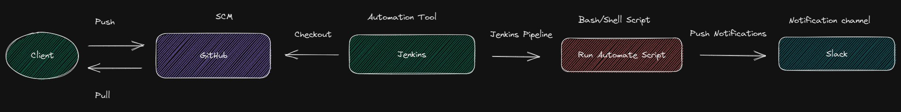

# Automate Scan.
This repository contains a tool for automating the process of scanning for vulnerabilities in a list of domains. The tool is designed to streamline the process of identifying potential security weaknesses and provide an easy-to-read report of its findings.

### Requirements Locally.
* bash
* Nmap

### Installation Locally.
Clone the repository:
```
git clone https://github.com/capstone-project-cybersecurity/automate-scan.git
cd $PWD/automate-scan
```

### Usage Locally.
To run the tool, simply execute the following command in the repository directory:
```
./automate-scan.sh
```

The tool will then run a series of scans based of the list.txt and generate a output of the finding.

### Requirements with Docker.
To run the tool inside a container is going to be more scalable and portable.
* docker
* bash

### Installation with Docker.
Clone the repository:
```
git clone https://github.com/capstone-project-cybersecurity/automate-scan.git
cd $PWD/automate-scan
docker build -t automate-scan . && docker run automate-scan
```

### Requirements with Docker and Jenkins as automation tool.
To run the tool inside a container is going to be more scalable and portable. Also we can integrate with automation tool.
* docker
* docker compose
* Jenkins as a container

### Installation with Docker and Jenkins.
Clone the repository:
```
git clone https://github.com/capstone-project-cybersecurity/automate-scan.git
cd $PWD/automate-scan/ci
docker build -t jenkins-customized-project .
docker tag $(docker images | grep jenkins-customized-project | awk '{print $3}') danielgomeza/jenkins-customized-project
docker login
docker push danielgomeza/jenkins-customized-project:latest
docker-compose up -d
curl http://localhost:8080 # test that you already can reach jenkins web locally
```

### Step by step with Jenkins (screenshots)

[Build Jenkins as container](./img/docker-build-jenkins.jpg)

[Docker tag local image](./img/docker-tag-local-image.jpg)

[Dockerhub create repository](./img/dockerhub-repository.jpg)

[Docker push to container registry](./img/docker-push-to-container-registry.jpg)

[Docker-compuse up](./img/docker-compose-up.jpg)

[Sign in Jenkins tool](./img/sigin-in-jenkins.jpg)

[Getting temporal credential](./img/temporal-credential-jenkins.jpg)

[Copy and paste the credential](./img/paste-cred-to-jenkins-web.jpg)

[Install suggested pluggin](./img/install-suggested-plugins.jpg)

[Installing plugins](./img/installing-plugins.jpg)

[Create first admin](./img/create-first-admin.jpg)

[Creating admin user](./img/fields-create-first-admin-user.jpg)

[Instance configuration](./img/instance-config.jpg)

[Jenkins ready](./img/jenkins-ready.jpg)

[Jenkins homepage](./img/welcome-jenkins.jpg)

[Pipeline creation](./img/create-new-multibranch-pipeline.jpg)

[Getting clone URL](./img/clone-from-SCM.jpg)

[Cloning from Jenkins](./img/clone-from-scm-from-jenkins.jpg)

[Configurating Jenkins](./img/input-jenkins-location.jpg)

[Pipeline ready](./img/pipeline-scaning.jpg)

[Seaching slack notification pluggin](./img/install-pluggin-slack-notification.jpg)

[Installing slack notification pluggin](./img/install-pluggin.jpg)

[Pluging installed](./img/pluging-installed.jpg)

[Adding jenkins ci app](./img/add-jenkins-ci-app-in-slack.jpg)

[Configuring token channel](./img/config-token-channel.jpg)

[Configuring slack notification](./img/config-slack-notification-in-slack.jpg)

[Jenkins configuration slack token](./img/jenkins-config-slack-token.jpg)

[Jenkins finished configuration slack notification](./img/config-slack-jenkins.jpg)

[Building jenkins pipeline](./img/building-jenkins.jpg)

[Slack notification](./img/results-in-slack.jpg)

[Scan finished with results](./img/scan-finished.jpg)


### Flow diagram



### Contributing
We welcome contributions to this project. If you would like to contribute, please fork the repository and create a pull request with your changes.

### License
This project is licensed under the [MIT License](https://opensource.org/licenses/MIT).